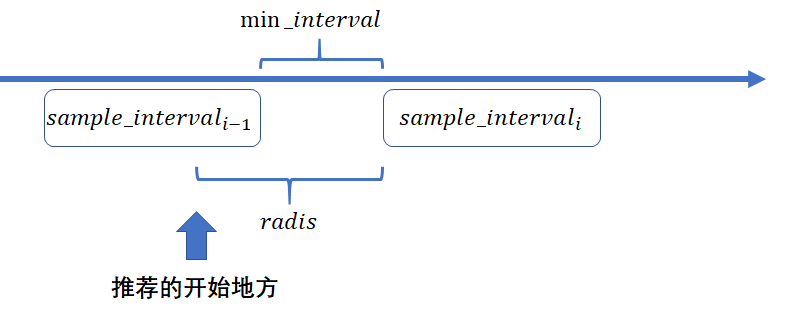
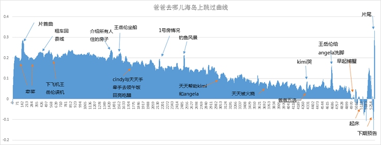

# VClimax

基于弹幕的视频精彩片段推荐系统。

能通过你想到的关于弹幕的一切，来定位视频精彩内容。

目前内置功能有：

1. 目前可以通过弹幕单位时间增长速率，设置相关的阈值，来定位最精彩的内容。
2. 跳转部分番剧OP
3. 视频搞笑片段精准定位

idea来源: [如何自动做一期梗百科](https://www.bilibili.com/video/BV1Y54y1X74i)

目前只支持B站弹幕系统，只支持Chrome插件，无油猴版本。

## 下载安装

Google商店目前还在审核中。
V1.0.0目前可在[release](https://github.com/baolintian/VClimax/releases/download/v1.0.0/VCLlimax.crx)中下载使用。

## 为什么通过弹幕系统

在2019年10月左右，Bilibili上线了高能进度条功能，这个进度条是怎么产生的呢？首先不是单位时间内弹幕的数量，经过浏览器，发现是通过播放点击次数来进行确定的。

而广大的网友发现，这个高能进度条基本上在跳新番上有很好的效果，事实上确实如此，也证明了高能进度条的曲线是受点击次数影响的。

使用过一段时间之后，发现高能进度条不是很准，通过该[例子](<https://www.bilibili.com/video/BV14j411f7c3>)，如下图所示：

通过人主观的选择，发现第一个第二个片段都是整个视频的高潮，但是高能进度条根本无法显示出第一个片段。

然而，通过弹幕的数量，却能很清晰的展示一个视频到底哪里是最精彩的，哪里是刷梗的地方。

于是，通过弹幕数量、内容进行建模，来实时的推荐视频精彩片段，帮助用户更好的定位视频的内容。

## 模型原理

假设此刻在$sample\_interval_{i}$，通过$min\_interval$得到$sample\_interval_{i-1}$, 然后得到$增长量=sample\_interval_{i}-sample\_interval_{i-1}$, 若增长量超过某一个设置的阈值，则将该片段推荐给用户，推荐开始的地方是$此刻时间-radis$，没有结束部分。

关于跳过OP、视频搞笑、视频刷梗的地方，可以通过正则表达式直接匹配操作。

## 展示示例

### 炮姐

[视频来源](<https://www.bilibili.com/video/BV1Js411o76u>)

### 跳过op

### 5G测速

[视频来源](<https://www.bilibili.com/video/BV1f4411M7QC>)

### 云在线吸猫

[视频来源](<https://www.bilibili.com/video/BV14j411f7c3>)

## 关于高能进度条的历史

众所周知，最早类似功能是P站推出的。

甚至这样：

当然，爱奇艺也推出了自己的“绿镜”系统：

这个是通过某些智能算法来感知视频的内容，从而精准推荐？我反正是不信的，这么多视频哪来这么多的计算资源，估计也是基于点击量来进行推荐的。

## 致谢

本项目遵循GPL3.0协议，非常感谢下面的开源项目

[pakku](<https://github.com/xmcp/pakku.js>)

[chrome-extension-video-playback-rate-controller](https://github.com/YiNanKai/chrome-extension-video-playback-rate-controller)

感谢下面的教程：

[How to make a chrome extension](<https://thoughtbot.com/blog/how-to-make-a-chrome-extension>)